# KuenteCO 💰

<p align="center">
  
</p>

<p align="center">
  
  
  
  
  
</p>

<p align="center">
  <a href="https://github.com/AlthosKal/KuenteCO/actions/workflows/build.yml">
    
  </a>
</p>

## 📘 Introducción

**KuenteCO** es una solución integral de gestión financiera diseñada para dar control financiero personal y empresarial. Esta plataforma multiplataforma, basada en una arquitectura de microservicios, combina la potencia de un backend robusto con una interfaz intuitiva, permitiendo a usuarios particulares y pequeñas/medianas empresas tomar el control total de sus finanzas.

### 🎯 Misión del Proyecto

Transformar la manera en que las personas y negocios gestionan sus recursos financieros, proporcionando herramientas profesionales accesibles desde cualquier dispositivo, con la seguridad y escalabilidad que demanda el mundo moderno.

Este repositorio contiene el código fuente completo de KuenteCO, estructurado en una **arquitectura modular de microservicios** que facilita el desarrollo, mantenimiento y escalabilidad del sistema.

---

## 🌐 Características Principales

### 💼 Gestión Financiera Integral
- ✅ **Registro intuitivo** de ingresos y egresos con categorización automática.
- ✅ **Presupuestos inteligentes** con alertas y seguimiento en tiempo real.
- ✅ **Metas de ahorro** con visualización de progreso y proyecciones.
- ✅ **Informes financieros** con gráficos interactivos y análisis de tendencias.
- ✅ **Gestión multi-cuenta** para el manejo de negocios.
- ✅ **Importación automática** de transacciones bancarias.
- ✅ **Análisis predictivo** para optimizar la toma de decisiones.

### 💬 Asistente Financiero con IA
- ✅ **Chatbot inteligente** para resolver dudas financieras y dar recomendaciones.
- ✅ **Análisis de sentimiento** en las consultas para entender la preocupación del usuario.
- ✅ **Generación de informes** a través de comandos de lenguaje natural.

### 🛡️ Seguridad y Escalabilidad
- 🔐 **Autenticación JWT** con tokens seguros y renovables en todos los servicios.
- 🌐 **Arquitectura de Microservicios** para un despliegue y escalado independiente.
- 📊 **Alta disponibilidad de Base de Datos** con replicación Master-Slave para el servicio principal.
- 🔄 **Sincronización en tiempo real** entre dispositivos.
- 🚀 **Escalabilidad horizontal** con contenedores Docker.

## 🛠️ Stack Tecnológico

### Frontend
- **Flutter 3.0+** - Framework multiplataforma para desarrollo móvil y web.
- **Dart** - Lenguaje de programación optimizado para UI.
- **Provider** - Gestión de estado reactiva.
- **Dio** - Cliente HTTP avanzado para comunicación con las APIs.

### Backend (Microservicios)
- **KuentecoApp (Core Financiero)**
  - **Spring Boot 3.5.0** - Framework Java enterprise.
  - **Spring Security** - Autenticación y autorización.
  - **Spring Data JPA** - Persistencia con Hibernate ORM.
  - **PostgreSQL 15+** - Base de datos relacional.
  - **Flyway** - Migraciones de base de datos.
- **KuentecoChat (Asistente IA)**
  - **Spring Boot 3.5.0**
  - **Spring AI (OpenAI)** - Integración con modelos de lenguaje.
  - **MongoDB** - Base de datos NoSQL para almacenar conversaciones.

### Infraestructura y DevOps
- **Docker & Docker Compose** - Contenerización completa del stack.
- **Nginx** - Proxy inverso y balanceador de carga (en roadmap).
- **Maven** - Gestión de dependencias y construcción.
- **GitHub Actions** - Integración Continua (CI).
- **SonarCloud** - Análisis estático de código y cobertura.

---

## 🏢 Arquitectura del Sistema

KuenteCO utiliza una arquitectura de microservicios contenerizada, diseñada para ser segura, escalable y mantenible.

```mermaid
graph TD
    subgraph "Cliente"
        A[📱 Cliente Flutter]
    end

    subgraph "Red Pública"
        B(🌐 Internet)
    end

    subgraph "Capa de Entrada (DMZ)"
        C( kuenteco-ui <br> Frontend Nginx)
    end

    subgraph "Red Privada (Backend)"
        D( kuenteco-app <br> API Principal)
        E( kuenteco-chat <br> API de Chat IA)
    end

    subgraph "Capa de Datos"
        F(postgres-master-database <br> PostgreSQL Master)
        G(postgres-replica-database <br> PostgreSQL Slave)
        H(mongo-database <br> MongoDB)
    end

    A --> B --> C
    C --> D
    C --> E
    D --> F
    D --> G
    E --> H
```



### 🔗 Componentes Principales

| Servicio | Imagen Docker | Puerto (Host) | Descripción |
|------------|-------------|---------|-------------|
| **Frontend** | `yefff/image-frontend-kuenteco-ui:1.0.6` | `:80` | Interfaz web Flutter servida con Nginx. |
| **Backend API** | `yefff/image-backend-kuenteco-app:1.0.6` | `:8080` | API REST principal para la gestión financiera. |
| **Chat API** | `yefff/image-backend-kuenteco-chat:1.0.4` | `:7070` | API para el asistente de IA. |
| **DB Master** | `yefff/image-master-kuenteco:1.1.1` | `:5432` | Base de datos PostgreSQL principal (R/W). |
| **DB Slave** | `yefff/image-slave-kuenteco:1.1.2` | `:5433` | Réplica de PostgreSQL para lectura. |
| **Chat DB** | `yefff/image-mongo-kuenteco:1.0.0`| `:27017` | Base de datos MongoDB para el chat. |

---

## 🚀 Guía de Despliegue

### 🔧 Requisitos Previos

- **Docker** y **Docker Compose**
- **Git**
- **4GB RAM** mínimo recomendado

### 📜 Configuración Rápida

1. **Clonar el repositorio**
   ```bash
   git clone https://github.com/AlthosKal/KuenteCO.git
   cd KuenteCO
   ```

2. **Configurar variables de entorno**
   Crea un archivo `.env` en la raíz del proyecto basado en `.env.example` (si existe) o usando las variables requeridas por los servicios.

3. **Desplegar el stack completo**
   ```bash
   docker compose up -d
   ```

4. **Verificar el estado**
   ```bash
   docker compose ps
   ```

### 🔍 Documentación de las APIs
- **KuentecoApp API**: [http://localhost:8080/swagger-ui.html](http://localhost:8080/swagger-ui.html)
- **KuentecoChat API**: [http://localhost:7070/swagger-ui.html](http://localhost:7070/swagger-ui.html)

---

## 📝 Roadmap

### ✔️ Versión Actual (v1.0)
- ✅ **Microservicios**: API principal y API de chat funcional.
- ✅ **Base de datos**: PostgreSQL con replicación y MongoDB.
- ✅ **Frontend**: Aplicación móvil Flutter y versión web básica.
- ✅ **CI/CD**: Integración con GitHub Actions y SonarCloud.

### 🔜 Próximas Funcionalidades (v1.1)
- 🔄 **Frontend Web Completo**: Mejorar la PWA y la experiencia de escritorio.
- 🔄 **Notificaciones Push**: Alertas en tiempo real para presupuestos y metas.
- 🔄 **Importación Bancaria**: Conexión con Plaid o similar para importar transacciones.
- 🤖 **Mejoras al Chatbot IA**: Añadir más capacidades y contexto financiero.

### 🔮 Futuro (v2.0+)
- 🌐 **Multi-tenancy** para dar servicio a múltiples empresas.
- 💳 **Integraciones de Pago** ampliadas.
- 🖥️ **Aplicación de escritorio** dedicada (Electron/Tauri).
